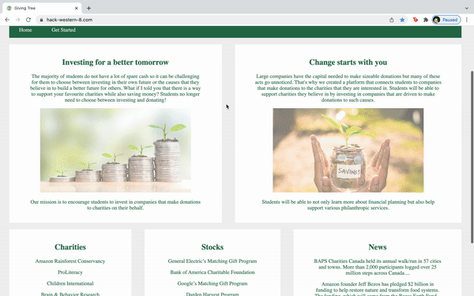

# Hack Western 8

## Table of Contents
- [About](#About)
- [Impact](#Impact)
- [Installation](#Installation)
- [Demo](#Demo)
- [Flask](#Flask)
- [AWS Elastic Beanstalk](#AWS-Elastic-Beanstalk)
- [AWS CodePipeline ](#AWS-CodePipeline )
- [AWS Route 53](#AWS-Route-53)
- [AWS Certificate Manager](#AWS-Certificate-Manager)

## About
Many students would like to support charities but do not have the income needed to make such charitable donations.
However, large companies have the capital to make sizeable contributions to philanthropic services and many of these acts go unnoticed. 
Our goal is to make a website that showcases the donations that various companies make so that students can invest in them.

## Impact
1. Promote financial planning to students
2. Encourage companies to support charities
3. Encourage students to support companies that make these contributions

## Installation
```shell script
$ pip3 install -r requirements.txt
```

## Demo
Created using: https://ezgif.com/maker<br/><br/>
  

## Flask
```shell script
$ touch application.py

from flask import Flask
application = Flask(__name__)
@application.route('/')
def hello_world():
	return 'Hello World'
```
```shell script
$ export FLASK_APP="application.py"
$ flask run
```
Now runs locally: <br/>
http://127.0.0.1:5000/<br/>

## AWS Elastic Beanstalk
Create a Web Server Environment: 
```shell script
AWS -> Services -> Elastic beanstalk
Create New Application called hack-western-8 using Python
Create New Environment called hack-western-8-env using Web Server Environment
```
## AWS CodePipeline
Link to Github for Continuous Deployment:
```shell script
Services -> Developer Tools -> CodePipeline
Create Pipeline called hack-western-8
GitHub Version 2 -> Connect to Github
Connection Name -> Install a New App -> Choose Repo Name -> Skip Build Stage -> Deploy to AWS Elastic Beanstalk
```
This link is no longer local: <br/>
http://hack-western-8-env.eba-a5injkhs.us-east-1.elasticbeanstalk.com/ <br/>

## AWS Route 53
Register a Domain:
```shell script
Route 53 -> Registered Domains -> Register Domain -> hack-western-8.com -> Check
Route 53 -> Hosted zones -> Create Record -> Route Traffic to IPv4 Address -> Alias -> Elastic Beanstalk -> hack-western-8-env -> Create Records
Create another record but with alias www.
```
Now we can load the website using:<br/>
[hack-western-8.com](http://hack-western-8.com)<br/>
www.hack-western-8.com<br/>
http://hack-western-8.com<br/>
http://www.hack-western-8.com<br/>
Note that it says "Not Secure" beside the link<br/>

## AWS Certificate Manager
Add SSL to use HTTPS: 
```shell script
AWS Certificate Manager -> Request a Public Certificate -> Domain Name "hack-western-8.com" and "*.hack-western-8.com" -> DNS validation -> Request
$ dig +short CNAME -> No Output? -> Certificate -> Domains -> Create Records in Route 53
Elastic Beanstalk -> Environments -> Configuration -> Capacity -> Enable Load Balancing
Load balancer -> Add listener -> Port 443 -> Protocol HTTPS -> SSL certificate -> Save -> Apply
```
Now we can load the website using:<br/>
https://hack-western-8.com<br/>
https://www.hack-western-8.com<br/>
Note that there is a lock icon beside the link to indicate that we are using a SSL certificate so we are secure<br/>